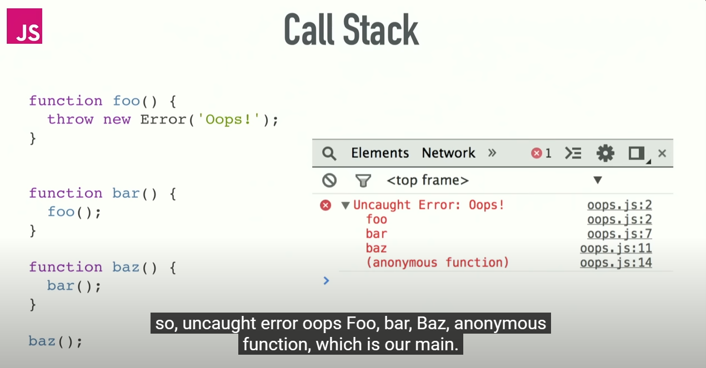

References:
https://nodejs.org/en/docs/guides

READ THIS: https://nodejs.org/en/docs/guides/dont-block-the-event-loop (Nodejs is pretty scalable if you dont write bad code that blocks the event loop. Be sensible)

# What is Node.js?
Node.js is a javascript runtime environment. Which means it can execute javascript code anywhere else other than the browser. 

# How does it work?
Node.js uses V8 Engine. V8 is basically the javascript engine built by Google which runs javascript code in the browser. The engine takes javascript code, 
compiles it into the machine code (This is also what the browser does). V8 is written in C++. 
So, Node.js takes V8 codebase, and adds certain features like working with local files (Which is not possible with the original V8 engine code) and removes certain features like manipulating dom (Obviously dom will not be present outside the browser.)

# Event loop
Event loop is what allows Nodejs to perform ```non-blocking I/O (input/output) operations``` despite the fact that Nodejs runs javascript on a single thread, by offloading operations to system kernel whenever possible.

Some examples of IO Operations:

1. ```File I/O```: Reading / Writing to files, creating /removing directories, files etc
2. ```Network I/O```: HTTP requests, DNS lookups, WebSockets, establishing tcp/udp connections etc
3. ```Database I/O```: Database calls to MySQL, Mongo etc


Since most modern kernels are multi-threaded, they can handle multiple operations executing in the background. When one of these operations completes, the kernel tells Node.js so that the appropriate callback may be added to the poll queue to eventually be executed

# Event Loop Explained

When Node.js starts, it initializes the event loop, processes the provided input script which may make async API calls, schedule timers, or call process.nextTick(), then begins processing the event loop.

```js
eventLoop.init();
processInputScript();
eventLoop.process();
```

The event loop processes the callbacks in the order below:
    
1.  ```Timers```
2. ```Pending callbacks```
3. ```Idle, prepare```
4. ```Poll``` (For incoming connections, data etc)
5. ```Check```
6. ```Close Callbacks```

Each phase has a FIFO queue of callbacks to execute. While each phase is special in its own way, generally, when the event loop enters a given phase, it will execute callbacks in that phase's queue until the queue has been exhausted or the maximum number of callbacks has executed. When the queue has been exhausted or the callback limit is reached, the event loop will move to the next phase, and so on.


## Timers:
This phase executes callbacks scheduled by setTimeout() and setInterval(). Note the event loop will process these timer callbacks until the queue is empty or it has processed maximum number of callbacks that it can process in the current phase.

```js
setTimeout(() => {
  console.log('Callback 1');
}, 1000);

setTimeout(() => {
  console.log('Callback 2');
}, 500);

// Output:
// Callback 2
// Callback 1
```

## Pending callbacks
Executes I/O callbacks deferred to the next loop iteration. These are typically used for callbacks from asynchronous operations, like file I/O or network operations.

Note the event loop will process these I/O callbacks until the queue is empty or it has processed maximum number of callbacks that it can process in the current phase.

```js
const fs = require('fs');

fs.readFile('file.txt', (err, data) => {
  console.log('Read file callback');
});

// Event loop executes the pending callback when the file read is complete.
// Output: Read file callback
```

## Idle, Prepare
These phases are used internally by Node.js and aren't typically relevant for application-level code.


Here, input script means the script that we provide when we invoke node binary. 
```
node server.js // here server.js is the input script
```

## Polling
In this phase, the event loop retrieves new I/O events; execute I/O related callbacks. Note the event loop will process these the I/O until there are no more requests or it has processed maximum number of requests that it can process in the current phase.

```js
const http = require('http');

const server = http.createServer((req, res) => {
  res.end('Hello, World!');
});

server.listen(3000, () => {
  console.log('Server listening on port 3000');
});

// The event loop is in the poll phase, waiting for incoming HTTP requests.

```

The event loop checks for any incoming client requests like HTTP in our Node.js application. If there are any requests, the event loop tells the Node.js runtime to execute the corresponding callback, and the callback is added to the call stack.

If there are any asynchronous operations like network operations (Only DNS lookups, http requests are handed off to the operating system underlying network stack) or setTimeout within these callbacks, those operations are handed off to libuv by the Node.js runtime.

The event loop then checks if there are any completed operations from libuv (file operations, dns lookups etc), operating system network (Remember for http requests) etc . If there are any completed operations, then the event loop would add the corresponding callbacks to the appropriate queue (timer queue for timer callbacks, I/O queue for I/O callbacks, etc.).

If there are no more client requests or no more completed operations from libuv or it has processed maximum number of requests that it can process in the current phase, then it would exit from this phase.

## Check phase
This is where the setImmediate callbacks would get executed.

## Close phase
This is where the callbacks related to ```close``` event gets executed. For eg., ```socket.on('close', callbackFn)```
(Read about event emitters)


# NOTE
Before starting any phase or after any phase, the event loop checks if there are any callbacks to be executed which were resolved / rejected by the ```promises```. These callbacks are added to a queue called ```microtask queue``` which has ```higher priority``` than any phase in the event loop

Eg., code
```js
const func = async() => {
    return new Promise((resolve, reject) => {
        resolve();
    })
}

func().then(() => {
    console.log("Promise resolved");
})

setTimeout(() => {
    console.log("Timeout callback")
}, 0);
```

In the above code, when the promise is resolved ```the v8 engine or the interpreter``` itself adds the callback to the ```microtask queue```. And the callback gets processed before the phases of the event loop start.

So the output is
```
Promise resolved
Timeout callback
```

## process.nextTick()
The callbacks present in process.nextTick scheduled to run immediately after the current phase of the event loop

Example:
```js
let bar;
// this has an asynchronous signature, but calls callback synchronously
function someAsyncApiCall(callback) {
  callback();
}
// the callback is called before `someAsyncApiCall` completes.
someAsyncApiCall(() => {
  // since someAsyncApiCall hasn't completed, bar hasn't been assigned any value
  console.log('bar', bar); // undefined
});
bar = 1;
```

But if we use process.nextTick()

```js
let bar;
function someAsyncApiCall(callback) {
  process.nextTick(callback);
}
someAsyncApiCall(() => {
  console.log('bar', bar); // 1
});
bar = 1;
```

## How node handles events like req.on('data', callbackFn)

In Node.js, when an HTTP request is received, the request data is often streamed to the server in chunks. The ‘data’ event is emitted each time a chunk of data arrives, and the ‘end’ event is emitted when all data has been received.

During the Poll phase of the event loop, Node.js checks for new I/O events like these ‘data’ events. When a ‘data’ event occurs, its callback is executed immediately. This does not block the event loop because only one callback is executed at a time, and Node.js can continue to process other events between these callbacks. (**For a request, Node does not wait for the entire request until the request emits a end event**)

If a single request sends a large amount of data, it could potentially take a long time to process all ‘data’ events for that request. However, because these events are processed one at a time in the event loop, Node.js can interleave the processing of ‘data’ events from multiple requests. This allows Node.js to handle many concurrent requests efficiently.

When all data for a request has been received and all ‘data’ events have been processed, an ‘end’ event is emitted. The callback for the ‘end’ event is also executed immediately when the event occurs.


## Important example
If you dont understand, read the above "How does Node work?" again.
```js
const func = async() => {
    console.log("func");
    return new Promise((resolve, reject) => {
        console.log("Inside promise");
        resolve()
        console.log("After resolve");
    })
}

func().then(data => {
    console.log("Resolved promise.")
});
console.log("Hi");
```

```
func
Inside promise
After resolve
Hi
Resolved promise.
```


Visulalise the flow: https://www.jsv9000.app/

Reference:
1)	Understanding Event Loop, Call Stack, Event & Job Queue in Javascript | by Rahul Sagore | Medium
2)	Tasks, microtasks, queues and schedules - JakeArchibald.com
3)	https://www.reddit.com/r/node/comments/147jf6t/how_does_node_work_internally/
4)	https://www.turing.com/kb/handling-memory-management-in-javascript

# What are the features of Node?
1) Node is built on chromes V8 engine written in C++, which makes it fast. (Read more from here: https://nodejs.dev/en/learn/the-v8-javascript-engine/)
2) Asynchronous and multi-threaded (See, Node.js runs javascript on a single thread., But Node.js provides hidden threads using libuv library (written in C++) which is used for file operations, network requests etc.)
3)	Non-Blocking and Event Driven. (When Node.js performs an I/O operation, like reading from the network, accessing a database or the filesystem, instead of blocking the thread and wasting CPU cycles waiting, Node.js will resume the operations when the response comes back.) (Read more from here: Overview of Blocking vs Non-Blocking | Node.js (nodejs.org))
4)	It has Node Package Manager (npm) which is a library of many packages.

# Callstack vs memory stack 
The call stack in JavaScript is different from the stack used for memory allocations. These two concepts are separate and serve different purposes in a JavaScript runtime environment.

**Call Stack**:

The call stack is a data structure in JavaScript that keeps track of the execution context of functions and their respective call frames.
It is responsible for managing the flow of program execution, tracking function calls, and maintaining the order in which functions are executed.
As functions are called, their call frames are pushed onto the call stack, and when a function returns, its call frame is popped off the stack.
The call stack is used for the execution of synchronous code and for maintaining the context of function calls.

When an error occurs, we get a stack trace as shown below


The anonymous function is the main function.

**Memory Stack**:

JavaScript uses a memory allocation stack (sometimes referred to as the "heap" and "stack") to manage the allocation and deallocation of memory for variables and objects.
This memory allocation stack is not exposed or directly accessible in JavaScript. It's managed by the JavaScript engine itself.
The memory stack is used to store primitive data types and references to objects in memory. Objects themselves are allocated in the heap, which is a separate region of memory.
Variables and objects are allocated and deallocated on the memory stack as needed.
In summary, the call stack is responsible for managing the execution context of functions, while the memory allocation stack manages the allocation and deallocation of memory for variables and objects. These two stacks serve different purposes within the JavaScript runtime, and they are not the same.

# How does node interpret js code?

Node follows the below four steps for interpreting js code

**Parsing and AST Creation**: Node.js starts by parsing the JavaScript source code and creating an Abstract Syntax Tree (AST). The AST represents the structure and semantics of the code.

**Execution via Interpretation**: Node.js initially interprets the code by traversing the AST. It doesn't convert the entire AST to machine code. Instead, it interprets the code directly from the AST, executing one statement at a time. This interpretation allows the code to run immediately without the need for a separate compilation step.

**Just-In-Time (JIT) Compilation**: To improve performance, Node.js and the V8 engine may employ JIT compilation. JIT compilation involves identifying frequently executed code segments and compiling those segments into optimized machine code. These compiled segments are then cached and executed for subsequent calls. This JIT compilation process is used to speed up the execution of performance-critical parts of the code. (Note the jit compilation code is stored in RAM and not in some binaries)

**Hybrid Execution**: Node.js uses a hybrid approach, combining interpretation and JIT compilation. Less frequently used parts of the code are interpreted, while hot paths (frequently executed code) are compiled for better performance.

In summary, Node.js interprets JavaScript code directly from the AST, executing it one statement at a time. However, for performance optimization, it may use JIT compilation to convert frequently executed code segments into machine code. This hybrid approach allows for the best of both worlds: immediate execution and performance improvements when needed.

