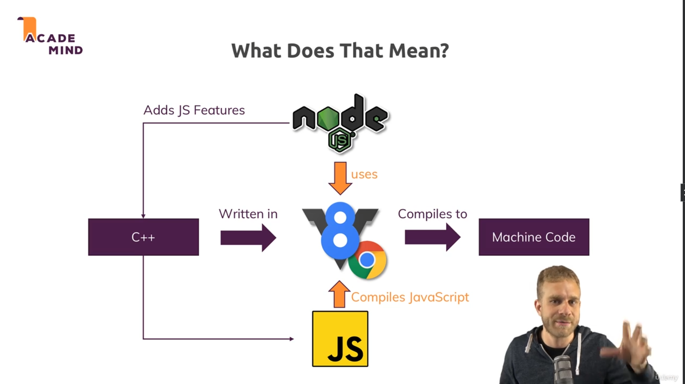

# What is Node.js?
Node.js is a javascript runtime environment. Which means it can execute javascript code anywhere else other than the browser. 

# How does it work?
Node.js uses V8 Engine. V8 is basically the javascript engine built by Google which runs javascript code in the browser. The engine takes javascript code, 
compiles it into the machine code (This is also what the browser does). V8 is written in C++. 
So, Node.js takes V8 codebase, and adds certain features like working with local files (Which is not possible with the original V8 engine code) and removes certain features like manipulating dom (Obviously dom will not be present outside the browser.)



So when our code gets executed by the javascript engine:
1)	All the memory allocations happen on stack or heap (Primitive type allocations (const x = 5, const y = true etc) happen on stack and array, object allocations happen on heap)

2)	When a function is needed to be executed, it is inserted into the callstack. The function is then removed from the callstack after execution.

3)	If the function is an async function (returns a promise, setTimeout etc), then node handles these operations using c++ libraries like libuv which uses threads (In case of browser, these are called browser apis which are handled by the browser itself). After node completes processing, the callback functions are then added into a callback queue or job queue (Only Promise.then or Promise.catch callbacks are added into the job queue and these have higher priority than callback queue functions)

4)	Event Loop: Event loop runs continuously to check if the call stack is empty or not. If the call stack is empty, then it processes all the job queue tasks, then it processes all the callback queue tasks (Here processing means that event loop would pop the function from the queue and put it on top of the call stack)
Pseudo code of event loop:

```javascript
runScript() //Synchronously execute the script as though it were a function body. Run until the Call Stack is empty.
while (true) {
  if(callStack.isEmpty()){
    const jobQueue = EventLoop.getJobQueue();
    if (jobQueue.hasNextTask()) {
        jobQueue.processNextTask();
    }

    const callbackQueue = EventLoop.getCallbackQueue();
    while (callbackQueue.hasNextMicrotask()) {
        callbackQueue.processNextMicrotask();
    }
    
    // the rerender step DOES NOT happen in node. It happens in browser.
    rerender();
  }
}
```


Visulalise the flow: https://www.jsv9000.app/

Reference:
1)	Understanding Event Loop, Call Stack, Event & Job Queue in Javascript | by Rahul Sagore | Medium
2)	Tasks, microtasks, queues and schedules - JakeArchibald.com
3)	https://www.reddit.com/r/node/comments/147jf6t/how_does_node_work_internally/
4)	https://www.turing.com/kb/handling-memory-management-in-javascript

# What are the features of Node?
1) Node is built on chromes V8 engine written in C++, which makes it fast. (Read more from here: https://nodejs.dev/en/learn/the-v8-javascript-engine/)
2) Asynchronous and multi-threaded (See, Node.js runs javascript on a single thread., But Node.js provides hidden threads using libuv library (written in C++) which is used for file operations, network requests etc.)
3)	Non-Blocking and Event Driven. (When Node.js performs an I/O operation, like reading from the network, accessing a database or the filesystem, instead of blocking the thread and wasting CPU cycles waiting, Node.js will resume the operations when the response comes back.) (Read more from here: Overview of Blocking vs Non-Blocking | Node.js (nodejs.org))
4)	It has Node Package Manager (npm) which is a library of many packages.

