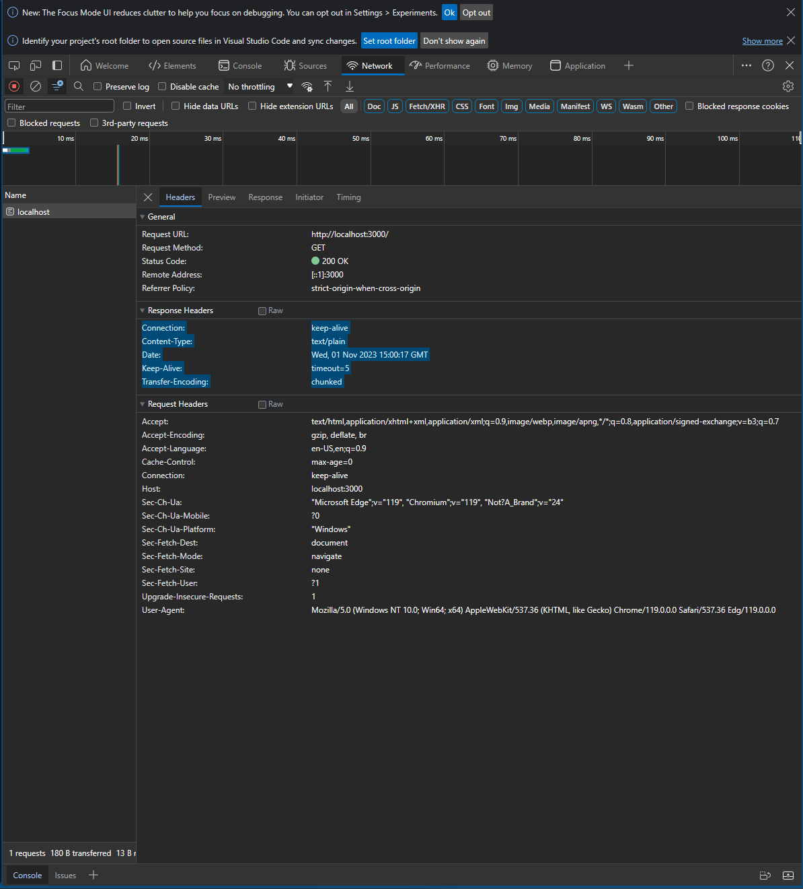

# Creating the server
Node.js provides us with some core node modules like ```http``` to start our servers. (Note that express which is a third party package also use http package in their internal implementation)

```js
// this package is already shipped with node
const http = require('http')

// create the server
const server = http.createServer((req, res) => {
    console.log(req);
});

// listen on port 3000
const port = 3000;

server.listen(port);

```
The above code will now listen for requests. To stop this process, we can use ```process.exit()``` as shown below

```js
// this package is already shipped with node
const http = require('http')

// create the server
const server = http.createServer((req, res) => {
    console.log(req);
    process.exit()
});

// listen on port 3000
const port = 3000;

server.listen(port);
```

Now when we log request, we see the output as defined in request.txt.

Most of the information is not useful for us. We are primarily interested in headers, url and method

# Some commonly used request methods
## request.headers
If we log ```req.headers```, we would see something as shown below
```js
{
  host: 'localhost:3000',
  connection: 'keep-alive',
  'cache-control': 'max-age=0',
  'sec-ch-ua': '"Microsoft Edge";v="119", "Chromium";v="119", "Not?A_Brand";v="24"',
  'sec-ch-ua-mobile': '?0',
  'sec-ch-ua-platform': '"Windows"',
  'upgrade-insecure-requests': '1',
  'user-agent': 'Mozilla/5.0 (Windows NT 10.0; Win64; x64) AppleWebKit/537.36 (KHTML, like Gecko) Chrome/119.0.0.0 Safari/537.36 Edg/119.0.0.0',
  accept: 'text/html,application/xhtml+xml,application/xml;q=0.9,image/webp,image/apng,*/*;q=0.8,application/signed-exchange;v=b3;q=0.7',
  'sec-fetch-site': 'none',
  'sec-fetch-mode': 'navigate',
  'sec-fetch-user': '?1',
  'sec-fetch-dest': 'document',
  'accept-encoding': 'gzip, deflate, br',
  'accept-language': 'en-US,en;q=0.9'
}

```
1) ```host```: Its specifies the target host and port where the client is making the request. In our case, it is localhost:3000

2) ```connection```: In the context of the "Connection" property in HTTP headers, it typically refers to the management of the underlying TCP (Transmission Control Protocol) connection. 

    TCP is the transport layer protocol used for establishing and managing connections between two devices over a network. In the context of web communication: When a client (e.g., a web browser) sends an HTTP request to a server, it typically opens a TCP connection to the server to transmit the request.

    The server processes the request and sends back an HTTP response over the same TCP connection.

    After the response is sent, the TCP connection can be closed, or, if the "Connection" header is set to ```keep-alive```, the connection can be kept open for potential reuse for subsequent requests.

    So, when you see "Connection: keep-alive" in an HTTP request or response header, it means that the client and server are indicating their willingness to maintain the underlying TCP connection open for a period of time to potentially accommodate multiple HTTP requests and responses. This is an optimization to reduce the overhead of repeatedly establishing and closing TCP connections for a series of related HTTP transactions.

```
NOTE: HTTP protocol is traditionally associated with TCP as its transport layer protocol. It's not common to use UDP for http requests. If we want to do this, then we have to design custom solutions since standard http does not use UDP as its transfer protocol
```

The ```connection``` property also can take other values like ```close``` when client wants a non persistant connection.

3. ```cache-control```: it defines whether the client wants a fresh response or a cached (stale response). ```max-age=0``` means it wants a fresh response every time.

4. ```sec-ch-ua```: Stands for **Security Client hints user agent**, it gives the information and the version of the browser. 

5. ```sec-ch-ua-mobile```: ```?0``` indicates the request did not come from mobile and ```?1``` indicates the request came from mobile.

6. ```accept```: The response format it prefers. Note that in the above example, we do not see ```application/json```. This does not mean that server cannot send ```application/json```. the ```accept``` property is more about the preferences of the data format the client wants.

7. ```accept-encoding```: This specifies the compression algorithms that the server can use to compress the responses


## request.method
It specifies the http verb of the request. For eg., GET, POST etc.

## request.url
It specifies the endpoint of the api.

# Some commonly used response methods

## response headers
In node, get access to response headers using ```res.getHeaders()``` method

It typically has the following structure:
```
statusCode: 200
Connection: keep-alive
Content-Type: text/plain
Date: Wed, 01 Nov 2023 15:00:17 GMT
Keep-Alive: timeout=5
Transfer-Encoding: chunked
```

```here keep-alive: timeout=5``` means the maximum seconds the server is willing to keep the tcp connection open (In this case, it is 5 seconds)

## response.statusCode
Status code to determine if the request was successful, or client error, server error etc


# Use browser to see the req and res info
Go to the network tab in dev tools and we can see the information



# Refer the below link to know more about headers
https://developer.mozilla.org/en-US/docs/Web/HTTP/Headers
