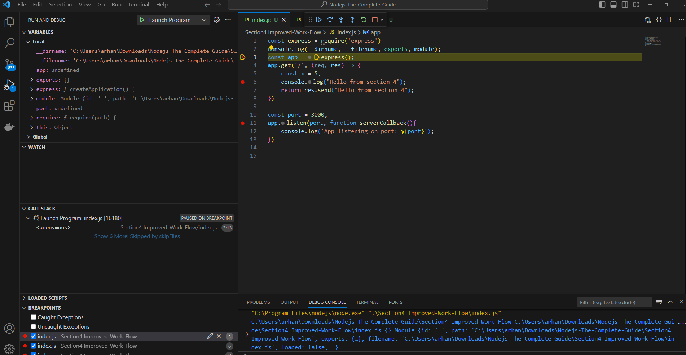
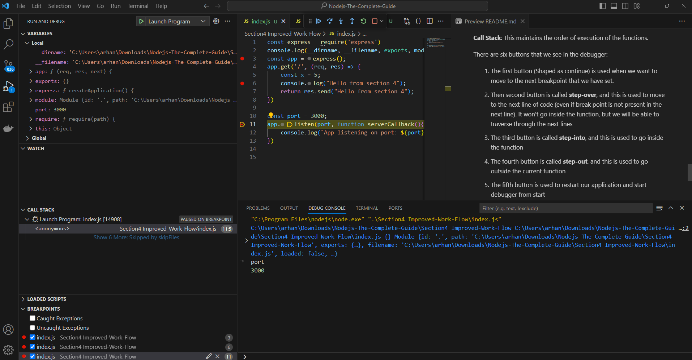

# Understanding NPM Scripts

1. **npm init**: Initialises our node project (Creates a package.json file which contains the project information like version, author, scripts, dependencies on other npm packages, licenses etc)

Eg., of package.json file:

```json
{
  "name": "section4-improved-work-flow",
  "version": "1.0.0",
  "description": "",
  "main": "index.js",
  "scripts": {
    "test": "echo \"Error: no test specified\" && exit 1"
  },
  "author": "",
  "license": "ISC"
}

```

In the scripts section, we can specify the scripts for our app. For eg., to start our app, we run ```node index.js```, Now we can specify to start our app as shown below

```json
{
  "name": "section4-improved-work-flow",
  "version": "1.0.0",
  "description": "",
  "main": "index.js",
  "scripts": {
    "test": "echo \"Error: no test specified\" && exit 1",
    "start": "node index.js"
  },
  "author": "",
  "license": "ISC"
}

```
Now whenever we run ```npm start``` in the project folder, our app would start since it internally executes ```node index.js``` command.

Note that there are some reserved keywords in the scripts section (start being one of them). So if we write any other script with some other name which does not fall under the reserved keywords (For eg., start-server), then ```npm start-server``` will throw an error. In this case, we have to run ```npm run start-server```.

# Installing third party packages
We install node packages from npm (which is node package manager, a cloud repo for all the node packages). Now lets say we want to install a package ```nodemon```, which helps us to automatically restart our server once a change is done in our codebase.

We do so using the npm install command.
```npm install nodemon```

But there are certain configurations that we can do. For eg., we can specify whether the nodemon package can go as a development package, or a production package. We would choose nodemon to be a development package since it is only used in development.

For development: ```npm install nodemon --save-dev```

In this case, the ```package.json``` would look like this:
```json
{
  "name": "section4-improved-work-flow",
  "version": "1.0.0",
  "description": "",
  "main": "index.js",
  "scripts": {
    "test": "echo \"Error: no test specified\" && exit 1",
    "start": "node index.js",
    "start-server": "node index.js"
  },
  "author": "",
  "license": "ISC",
  "devDependencies": {
    "nodemon": "^3.0.1"
  }
}
```


For production: ```npm install nodemon --save``` (As of npm version 5.0.0, ```npm install <package-name>``` is same as ```npm install <package-name> --save```)

In this case, the ```package.json``` file looks like this:

```json
{
  "name": "section4-improved-work-flow",
  "version": "1.0.0",
  "description": "",
  "main": "index.js",
  "scripts": {
    "test": "echo \"Error: no test specified\" && exit 1",
    "start": "node index.js",
    "start-server": "node index.js"
  },
  "author": "",
  "license": "ISC",
  "dependencies": {
    "nodemon": "^3.0.1"
  }
}
```

For global: ```npm install nodemon -g``` (This command will not install nodemon in our project but it will install the package globally so that we can use the nodemon package anywhere).

The command ```npm install``` installs all the dependencies listed in the package.json file and puts all the packages in the node_modules folder.

1. ```npm install```: This command will install `devDependencies` as well as ```dependecies```.
2. ```npm install --only=dev```: This command will install only `devDependencies`
3. ```npm install --only=production```: This command will install only `dependencies`

# Using the Debugger
To use the debugger in vs code, open the run option and select ```Start Debugging``` option. Before that set breakpoints in the code by selecting the line number in the ide.



The debugging would start from the 1st break point. On the left side, we can see three tabs: Variables, Watch and Call stack

**Variables**: As we know, all the variables, functions are hoisted (Remember that even though let, const and var are hoised, the hoisting is different for let and const than var because let and const fall into the temporal dead zone before they are defined). We can see that port which is a const variable is marked as undefined (This is because the debugger does not accurately capture the temporal dead zone of let and const variables)

**Note**: The variables that we see in the variables section, we can also change their values while debugging (Just double click and change the value). This can be useful when we try to test something quickly.

**Watch**: Here we can write the variable names that we want to monitor

**Call Stack**: This maintains the order of execution of the functions.

There are six buttons that we see in the debugger:

1. The first button (Shaped as continue) is used when we want to move to the next breakpoint that we have set.

2. Then second button is called **step-over**, and this is used to move to the next line of code (even if break point is not present in the next line). It won't go inside the function, but we will be able to traverse through the next lines

3. The third button is called **step-into**, and this is used to go inside the function

4. The fourth button is called **step-out**, and this is used to go outside the current function

5. The fifth button is used to restart our application and start debugger from start

6. This sixth option is for stopping the debugger.

**NOTE: Also while debugging, you can hover over your variables to see the values that they are containing.**

We can also use the debugger console to do operations on the variables, functions that are currently in scope at that point of time



# Debugging Node.js in Visual Studio Code
Want to dive super-deep into the latest debugging capabilities Visual Studio Code gives you (for Node.js apps)?

This article will be very helpful: https://code.visualstudio.com/docs/nodejs/nodejs-debugging

https://nodejs.org/en/docs/guides/debugging-getting-started