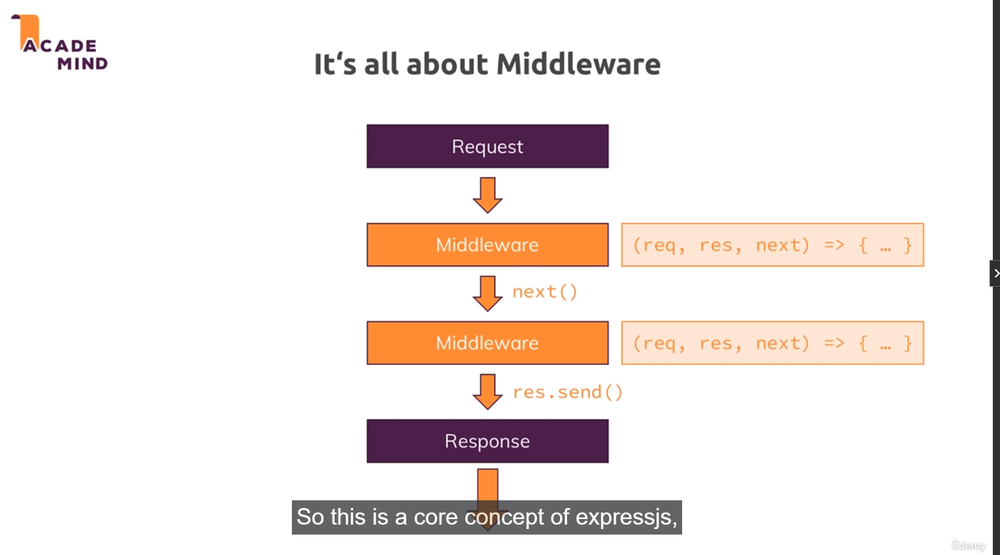

# Express
Express is a framework, which is used to 
1. Parse Incoming requests
2. Send appropiate responses to those requests

# Its all about the middleware


A middleware in express is basically a function which has access to req, res and next. It has the power to end the request-response cycle or pass the request to the next matching middleware.

# app.use
The app.use method takes in the middleware and the middleware would be executed for every request. (For every request, I mean next() has been called in the above middleware, or this is the first middleware which the request encounters)

```javascript
app.use((req, res, next) => {
    console.log("Hello from app.use");

    // to pass the request to the next matching middleware
    return next();

    // always return to avoid executing the code if it exists below next() or res.send()

    // or send a response
    return res.status(200).send("Hello express")
})
```

# Difference between app.use and app.get

app.use() only see whether url starts with specified path where app.get() will match complete path.
Here is an example to demonstrate this:

```
app.use( "/product" , mymiddleware);
// will match /product
// will match /product/cool
// will match /product/foo
```

```
app.get( "/product" , handler);
// will match /product
// won't match /product/cool   <-- important
// won't match /product/foo    <-- important
```

```
app.get( "/product/*" , handler);
// won't match /product        <-- Important
// will match /product/cool
// will match /product/foo
```

# How to get data from req


**NOTE**: Most of the post request data are sent in chunks using Chunked Transfer encoding.

Chunked Transfer Encoding is a mechanism used in HTTP to send data in chunks or pieces, rather than as a single, continuous stream. It's often used when the size of the data is unknown in advance or when the data is being generated dynamically and can't be buffered in memory entirely. This encoding method allows data to be sent incrementally, making it useful for streaming, large files, or real-time applications.

```js
const express = require('express');
const app = express();

// custom json body parsing middleware
const jsonBodyParsingMiddleware = (req, res, next) => {
    // get the content-type of the req data
    if(req["headers"]["content-type"] !== 'application/json'){
        return next();
    }
    
    let rawData = '';

    // whole body of the request is not sent in one shot. Meaning we wont get the whole data once the server gets the post request

    // The data is sent in chunks, so we register a callback to listen to data event and add the data

    // Once the data is sent successfully, the end event happens and then we try to parse the whole data

    // and move on to next middleware.
    req.on('data', (chunk) => {
        rawData += chunk.toString();
    });
    

    req.on('end', () => {
        console.log(rawData);
        try {
            const jsonData = JSON.parse(rawData);
            console.log("JSON Data Received.");
            req.body = jsonData;
        } catch (error) {
            console.log("Invalid JSON Data Received.")
        }
        return next();
    });
}

// In the same way, we can write custom middleware for handling form data

app.use(jsonBodyParsingMiddleware);


app.get('/', (req, res) => {
    return res.send("Hello from express!");
})

app.post("/", (req, res) => {
    const body = req.body;
    return res.status(200).send(body);
})


const port = 3000;
app.listen(port, () => {
    console.log(`Server running on port: ${port}`)
})
```

The above example is for getting the json data from the request body. There are other forms of content-type that we can send in request. Those are:
1) **application/json**: (Which we have seen above). (We also have application/javascript, application/xml)
2) **multipart/form-data**: (Multipart basically means that the data that we receive contains multiple parts, each with its own data and media type). We can have multiple file uploads, text data etc. <br/>
Eg.,: This is how the data looks like in the backend
```
------WebKitFormBoundary3d9qo3JzG8ntcIA1
Content-Disposition: form-data; name="file"; filename="example.jpg"
Content-Type: image/jpeg

[binary data]
------WebKitFormBoundary3d9qo3JzG8ntcIA1
Content-Disposition: form-data; name="text"

some text
------WebKitFormBoundary3d9qo3JzG8ntcIA1--
```
3) **text/plain, text/html**: For sending textual data or html data
4) **application/x-www-form-urlencoded**: Suitable For getting textual form data (But not getting file data). x means that the encoding type was initially considered experimental. www means that this form of data was designed for http requests, form means for sending form data and finally urlencoded means that the data is sent in a way similar to how query strings are encoded in urls.
**Eg.,: If we have fields key1, key2, key3 in our forms, this is how we would get data in the backend: key1=value1&key2=value2&key3=value3**

5) **binary**: Using binary, we can send only file data. But using multipart/form, we can send a mixture of textual and binary data. And also, the data organization for multipart/form is good which makes it easier to parse the data.

# Body parsing middleware for parsing multipart/form-data
```js
const express = require('express');
const http = require('http');
const fs = require('fs');
const path = require('path');
const { parse } = require('querystring');

const app = express();

// Set the upload directory
const uploadDir = __dirname + '/uploads';

// Create the upload directory if it doesn't exist
if (!fs.existsSync(uploadDir)) {
  fs.mkdirSync(uploadDir);
}

app.post('/upload', (req, res) => {
  let data = Buffer.from('');

  // Listen for 'data' event to accumulate incoming data
  req.on('data', (chunk) => {
    data = Buffer.concat([data, chunk]);
  });

  // Listen for 'end' event to process the accumulated data
  req.on('end', () => {
    // Parse the content type header to get the boundary string
    const contentType = req.headers['content-type'];
    const boundary = contentType.split('; ')[1].split('=')[1];

    // Split the data using the boundary
    const parts = data.toString().split(`--${boundary}`);

    // Process each part (fields and files)
    for (const part of parts) {
      if (part.trim() === '') continue; // Skip empty parts

      if (part.includes('filename=')) {
        // This part contains a file
        const filenameMatch = /filename="([^"]+)"/.exec(part);
        if (!filenameMatch) continue;

        const filename = filenameMatch[1];
        const filePath = path.join(uploadDir, filename);

        // Extract the binary data part
        const binaryData = part.split('\r\n\r\n')[1];

        // Write the binary data to a file
        fs.writeFileSync(filePath, binaryData, 'binary');
      } else {
        // This part contains a regular field
        const nameMatch = /name="([^"]+)"/.exec(part);
        const value = part.split('\r\n\r\n')[1];

        if (nameMatch) {
          const fieldName = nameMatch[1];
          console.log(`Field Name: ${fieldName}, Field Value: ${value}`);
        }
      }
    }

    res.status(200).send('File uploaded successfully');
  });
});

app.get('/', (req, res) => {
  return res.send("Hello from Express!");
});

const server = http.createServer(app);
const port = 3000;
server.listen(port, () => {
  console.log(`Server running on port: ${port}`);
});
```

# Using BodyParser package makes life easier :)
It is a npm package which can be installed using ```npm i body-parser```

This package is used to get post data like json, form data in req.body. We just have to use the middlewares provided by bodyParser in app.use method

```javascript
const express = require('express');
const bodyParser = require('body-parser')
const app = express();

// to get json data in the req.body
app.use(bodyParser.json());

// to get form data in the req.body
app.use(bodyParser.urlencoded({extended: false}))
```

# Segregating apis using express.Router
We would be having many apis in our project. In this case, it is best to segregate them in seperate files. And this can be achieved using express.Router()

Make a ```routes``` folder and add your route files there. In the project, I had added two js files: admin.js and product.js

```admin.js```
```js
const express = require('express')
const router = express.Router();

router.get('/admin', (req, res) => {
    return res.status(200).send("This is admin page");
});

module.exports = router
```

```product.js```
```js
const express = require('express')
const router = express.Router();

router.get('/product', (req, res) => {
    return res.status(200).send("This is product page");
})

module.exports = router;
```

Now in ```app.js``` file, 
```js
const express = require('express');
const adminRoute = require('./routes/admin')
const productRoute = require('./routes/product')
const bodyParser = require('body-parser')
const app = express();

app.use(bodyParser.json());

// now use the routes
app.use(adminRoute)
app.use(productRoute)

// you can also specify the starting path of your route
// For eg
// app.use('/shop', productRoute)
// In the above case, api call to /shop/product would send "This is product page" response

app.get('/', (req, res) => {
    return res.send("Hello from express!");
})

app.post("/", (req, res) => {
    // will only be able to get json data
    const body = req.body;
    return res.status(200).send(body);
})

app.use('/', (req, res) => {
    return res.send("Hello from express!");
})


const port = 3000;
app.listen(port, () => {
    console.log(`Server running on port: ${port}`)
})

```

# process
```process``` is basically a global variable just like the ```window``` we have in the browser. 
Some important functions of process
1. ```process.mainModule.path```: Gives us the path of the directory which contains the app.js file (index.js or server.js). Basically the file which is the entry point of our application.
2. ```process.mainModule.filename```: Gives us the path of that entry point js file (index.js, server.js, app.js etc)